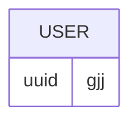

**Questions for Business**
- can instalment be refunded.
-  Ask how many students they have on a daily
**Phase 1**
- How will this database system help?
- Who uses the system
- How many users expected.
**Phase 2**
- Entities, attributes, relationships and Cardinality.
**Phase3**
- Conceptual model: Blueprint, focuses on what.
- Logical Schema, types of data and keys

- Meet boss on maximum orders
- Is there restocking on the weekends, how many days a week exactly. 
**Questions For AI:**
- If an Item is paid for is it reserved. and kept.
- For now they just manually take the details of the system. writing the details
- The student can take as they like but buyer holds the item.
- Those who pay instalment should be able to log in to the site with their matric and see the amount they have paid, this is amount should be uploaded by the seller(How can Moniepoint card payment be integrated). They can now get a telegram message or payment when their payment is 80% paid at least, or the semester is almost going to a close (date will be set in database), and an expected date(optional).
- If I decide to choose between optimizing _inventory turnover speed_ or to minimizing _outstanding customer debt_. WHat do they both involve, benefits trade offs. Which is more of a problem to solve.
- Only Boss should be able to manipulate transactions, seller should be able to see and set item price and subtract when the customer pays.
- The MoniePoint POS might be a bit of an issue because, they pay  and then update in the web app, seems manual, can they be chained , they can see all transactions and total transactions. 
- Transaction UI must be simple
- What are the nouns and entity that can be put in the business rule that can be obtained by group members.
- Money will be refunded if the user comes back but if not the money is kept. (The website can also take account number  for the customer table, as well as the name, matric, telegram, ig handle, hall, room number(This changes each semester), unique_id(is his advisable, to avoid duplication of matric and prices, can this be solved with normalisation))
- Every time an item hits zero stock or an installment payment is completed, the system should generate an internal alert or notification instance log accessible via the admin dashboard, , creating a clear audit trail between cashiers and management

## God's Wish Boutique
## Order and installment Tracking System 
one SUPPLIER per Item, Item may be SPORT, CORPORATE, CASUAL. 
One customer can make 0 or more orders.
Instalment Payment can be made but receive item on full Payment.  
Instalments are tracked manually, details taken during instalment. Hall, Room No, telegramNumber, Name, Ig_name
Discount, have a minimum must not go below the minimum. 
STAFF attributes, phoneNumber, Ighandle, name.
BOSS(admin) communicates with staff on items sold.
Restock: 
* Monday(Corporate Shirt, Corporate Trousers).
* Tuesday(Jerseys).
* Wednesday(Corporate Shirt, Corporate Trousers).
* Thursday(Belt Tie's boot).
* Friday(Track, Jacket, Joggers).
Once a shirt is sold it can't be returned. 
All clothes, jerseys have the same prize, not bound by size. 
Differ by type, Retro Jersey more expensive.
Other Accessory's include, belt, tye, cap. 